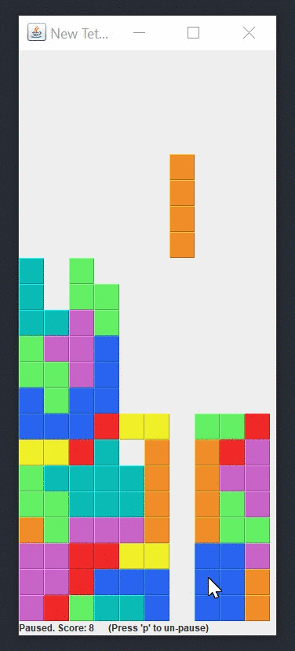

# Tetris

:video_game: A Java implementation of *Tetris*.  
Made with: `java.awt` & `javax.swing`  

## Demo
* Download `Tetris.jar` to play.

 

## Controls
| Key | Function |
| :---: | --- |
| `←` | Move left |
| `→` | Move right |
| `↓` | Move down |
| `↑` | Rotate piece |
| `space` | Drop piece |

 

## Author: Miffy Chen
* MET CS232 Programming with Java
* Final Project - Tetris
* Name: Miffy Chen
* Due Date: 2017/12/12
* Program Description: See pseudo code, UML diagram, and test parameters.
